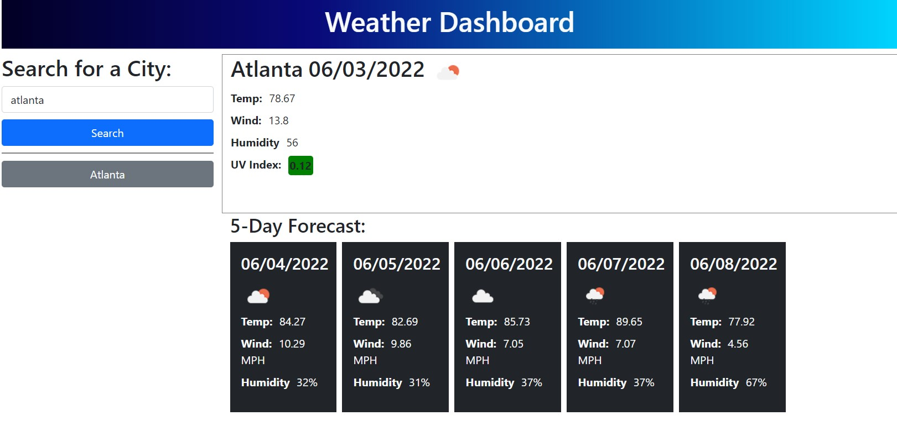

# weather-app

## Description

This project is an app to search the weather conditions in a city, featuring current and future forecasts, multiple relevant readings, and saved searches.

This could be helpful for anyone wanting to know weather in their area or to prepare for imminent travel.

The app builds on HTML and CSS with JavaScript, jQuery, and Bootstrap components.

## Usage

Screenshot of finding weather in Atlanta

Deployed application: https://bnicp.github.io/hw6-weather-app/

## Credits

Instructor, Trey Eckels, held a homework session.

## License

MIT License
